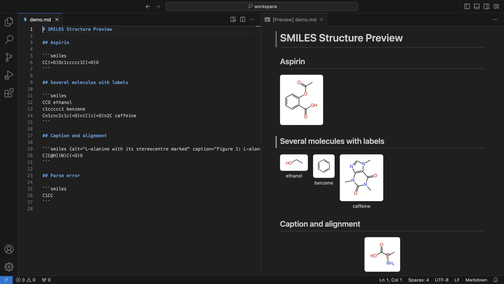
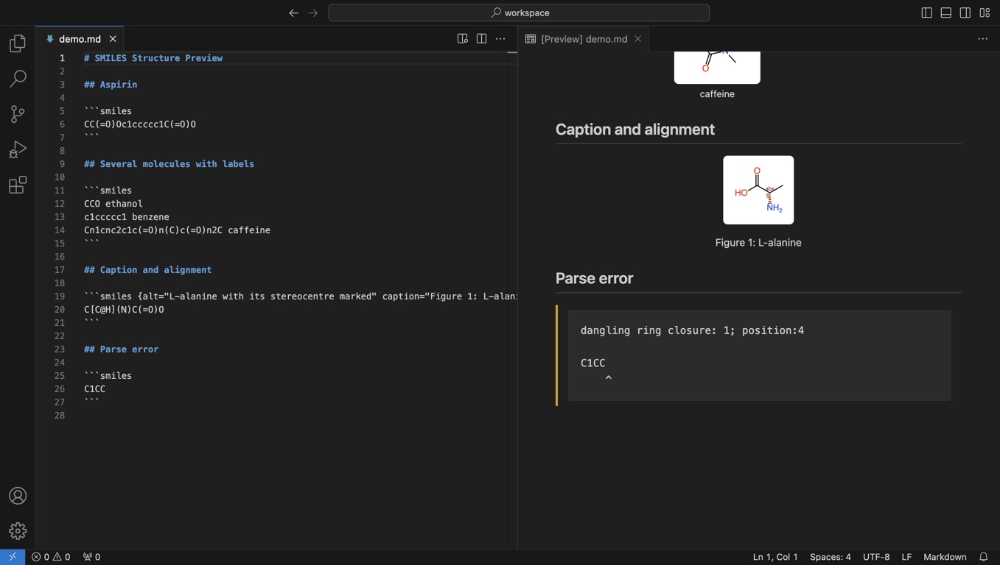

# SMILES Structure Preview

Adds SMILES molecular structure rendering to VS Code's built-in Markdown preview.

Write a SMILES string in a fence tagged `smiles`:

````markdown
```smiles
CC(=O)Oc1ccccc1C(=O)O
```
````

Only `smiles` fences are claimed — `smi` fences are left to other renderers.



## Several molecules

Each non-blank line is one molecule. Text after the first whitespace labels it,
as in `.smi` files; the molecules sit side by side with each label beneath:

````markdown
```smiles
CCO ethanol
c1ccccc1 benzene
[Na+].[Cl-] table salt
```
````

## Fence attributes

An optional attribute block after the tag adjusts how one fence is presented:

````markdown
```smiles {alt="Aspirin" caption="Figure 1: Acetylsalicylic acid" align="center"}
CC(=O)Oc1ccccc1C(=O)O
```
````

| Attribute | Effect |
| --- | --- |
| `alt` | Description for readers who cannot see the structure |
| `caption` | Text shown beneath the structure |
| `align` | `left`, `center` or `right` |
| `class` | Extra CSS class on each structure's `<svg>` |

Values are quoted. A mistyped or malformed attribute never costs you the
structure: it is ignored, and a note is written to the *SMILES Structure Preview*
output channel.



## Errors and limits

A SMILES parse error is shown in place of the structure, quoting the string with
a caret at the offending position. Depiction is limited to 4 KB per SMILES string
and, by default, 3 seconds per molecule; a molecule that takes longer shows a
timeout message until its string changes. Raise or lower the limit with the
`smiles.depictionTimeout` setting (seconds, 0.5 to 60); a change applies to the
next render, and molecules that timed out under the old limit are retried.

Structures are drawn on a white card with CPK element colours in every theme.
The extension reads no files, so it works fully in Restricted Mode and virtual
workspaces.

## Development

Requires Node 22 or newer (see `.nvmrc`).

```sh
npm ci
npm run lint            # tsc --noEmit
npm test                # node --test, after building
npm run package         # vsce package
npm run test:package    # the VSIX inside a real VS Code
npm run screenshots     # regenerate media/screenshots from examples/demo.md
```

## License

MIT for this extension; bundled OpenChemLib is BSD-3-Clause — see
[THIRD_PARTY_NOTICES.md](THIRD_PARTY_NOTICES.md).
